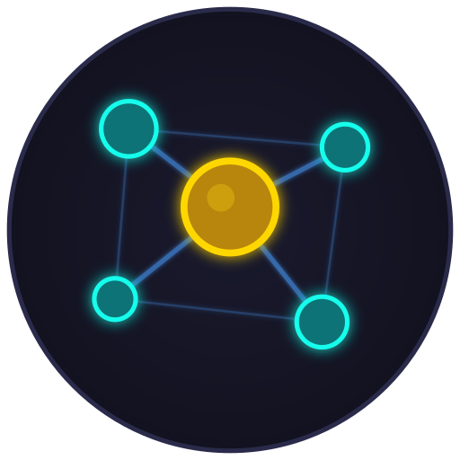

<p align="center">
  
</p>

# TheAgency

An opinionated multi-agent development framework for Claude Code.

## Overview

TheAgency is an opinionated convention-over-configuration system for running multiple Claude Code agents that collaborate on a shared codebase alongside one or more humans (Principals). Built for developers who want to scale their AI-assisted development workflows.

## 📋 Join the Community

[**Register for TheAgency Community**](https://docs.google.com/forms/d/e/1FAIpQLSfkH2bE1LB39u5iU-BamxbVC6jHmyDEE0TB6G2yw7xODdS-1A/viewform?usp=header) - Add yourself to TheAgency community!

## Key Features

- **Multiple Agents** - Specialized Claude Code instances with persistent context
- **Workstreams** - Organized areas of work with shared knowledge
- **Collaboration** - Inter-agent communication and handoffs
- **Quality Gates** - Enforced standards via pre-commit hooks
- **Session Continuity** - Backup and restore agent context across sessions

## Getting Started

For new projects, use [TheAgency Starter](https://github.com/the-agency-ai/the-agency-starter):

```bash
curl -fsSL https://raw.githubusercontent.com/the-agency-ai/the-agency-starter/main/install.sh | bash
```

See the [Quick Start Guide](claude/docs/QUICK-START.md) for detailed setup instructions.

## Repository Structure

- `tools/` - CLI tools for TheAgency
- `claude/` - Agent definitions, workstreams, and documentation

## For Contributors

See [CONTRIBUTING.md](CONTRIBUTING.md) for how to:
- Submit starter packs
- Improve core tools
- Report issues

## Documentation

- [CLAUDE.md](CLAUDE.md) - The constitution (main documentation)
- [claude/docs/](claude/docs/) - Guides and references
- [claude/docs/cookbooks/](claude/docs/cookbooks/) - Claude Cookbook patterns

## License

MIT License - see [LICENSE](LICENSE)

---

*TheAgency - Multi-agent development, done right.*
